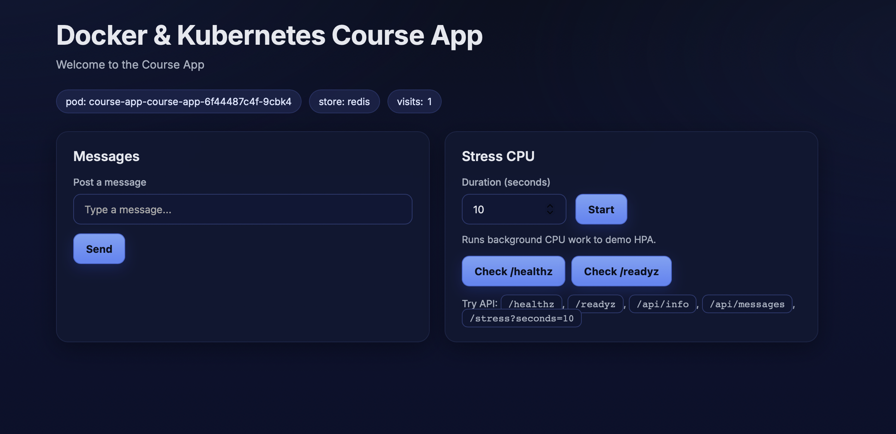

# lesson-11-Yevhen-Marholin

---

## 1. Створення Helm chart для course-app

Було створено Helm chart:

```bash
helm create course-app-chart
Creating course-app-chart
```

Видалено зайві файли:

```bash
rm -rf course-app-chart/templates/tests
rm course-app-chart/templates/hpa.yaml
rm course-app-chart/templates/serviceaccount.yaml
rm course-app-chart/templates/NOTES.txt
```

---

## 2. Шаблонізація (values.yaml)

Основні параметри було винесено у `values.yaml`:

```yaml
replicaCount: 3

image:
  repository: djmen12/course-app
  tag: latest
  pullPolicy: Always

service:
  type: ClusterIP
  port: 8080
  targetPort: 8080

ingress:
  enabled: true
  className: nginx
  host: course-app.local

env:
  APP_STORE: redis
  APP_REDIS_URL: redis://redis-master:6379
```

Це дозволяє змінювати конфігурацію без редагування шаблонів.

---

## 3. Helm templates

Було створено шаблони:

- Deployment
- Service
- Ingress

Приклад використання змінних у шаблоні:

```yaml
image: "{{ .Values.image.repository }}:{{ .Values.image.tag }}"
replicas: {{ .Values.replicaCount }}
```

У шаблонах відсутній хардкод — всі значення беруться з `values.yaml`.

---

## 4. Розгортання Redis через Bitnami

Додано Helm репозиторій:

```bash
helm repo add bitnami https://charts.bitnami.com/bitnami
helm repo update
"bitnami" has been added to your repositories
Hang tight while we grab the latest from your chart repositories...
...Successfully got an update from the "bitnami" chart repository
Update Complete. ⎈Happy Helming!⎈
```

Встановлено Redis:

```bash
helm install redis bitnami/redis \
  --set architecture=standalone \
  --set auth.enabled=false

NAME: redis
LAST DEPLOYED: Sun May 10 14:37:44 2026
NAMESPACE: default
STATUS: deployed
REVISION: 1
DESCRIPTION: Install complete
TEST SUITE: None
NOTES:
CHART NAME: redis
CHART VERSION: 25.5.2
APP VERSION: 8.6.3

⚠ WARNING: Since August 28th, 2025, only a limited subset of images/charts are available for free.
    Subscribe to Bitnami Secure Images to receive continued support and security updates.
    More info at https://bitnami.com and https://github.com/bitnami/containers/issues/83267

** Please be patient while the chart is being deployed **

Redis(R) can be accessed via port 6379 on the following DNS name from within your cluster:

    redis-master.default.svc.cluster.local

To connect to your Redis(R) server:

1. Run a Redis(R) pod that you can use as a client:

   kubectl run --namespace default redis-client --restart='Never'  --image registry-1.docker.io/bitnami/redis:latest --command -- sleep infinity

   Use the following command to attach to the pod:

   kubectl exec --tty -i redis-client \
   --namespace default -- bash

2. Connect using the Redis(R) CLI:
   redis-cli -h redis-master

To connect to your database from outside the cluster execute the following commands:

    kubectl port-forward --namespace default svc/redis-master 6379:6379 &
    redis-cli -h 127.0.0.1 -p 6379
WARNING: Rolling tag detected (bitnami/redis:latest), please note that it is strongly recommended to avoid using rolling tags in a production environment.
+info https://techdocs.broadcom.com/us/en/vmware-tanzu/bitnami-secure-images/bitnami-secure-images/services/bsi-doc/apps-tutorials-understand-rolling-tags-containers-index.html
WARNING: Rolling tag detected (bitnami/redis-sentinel:latest), please note that it is strongly recommended to avoid using rolling tags in a production environment.
+info https://techdocs.broadcom.com/us/en/vmware-tanzu/bitnami-secure-images/bitnami-secure-images/services/bsi-doc/apps-tutorials-understand-rolling-tags-containers-index.html
WARNING: Rolling tag detected (bitnami/redis-exporter:latest), please note that it is strongly recommended to avoid using rolling tags in a production environment.
+info https://techdocs.broadcom.com/us/en/vmware-tanzu/bitnami-secure-images/bitnami-secure-images/services/bsi-doc/apps-tutorials-understand-rolling-tags-containers-index.html
WARNING: Rolling tag detected (bitnami/os-shell:latest), please note that it is strongly recommended to avoid using rolling tags in a production environment.
+info https://techdocs.broadcom.com/us/en/vmware-tanzu/bitnami-secure-images/bitnami-secure-images/services/bsi-doc/apps-tutorials-understand-rolling-tags-containers-index.html
WARNING: Rolling tag detected (bitnami/os-shell:latest), please note that it is strongly recommended to avoid using rolling tags in a production environment.
+info https://techdocs.broadcom.com/us/en/vmware-tanzu/bitnami-secure-images/bitnami-secure-images/services/bsi-doc/apps-tutorials-understand-rolling-tags-containers-index.html

WARNING: There are "resources" sections in the chart not set. Using "resourcesPreset" is not recommended for production. For production installations, please set the following values according to your workload needs:
  - replica.resources
  - master.resources
+info https://kubernetes.io/docs/concepts/configuration/manage-resources-containers/
```

Перевірка:

```bash
kubectl get pods
kubectl get svc
NAME             READY   STATUS    RESTARTS   AGE
redis-master-0   1/1     Running   0          28s
NAME             TYPE        CLUSTER-IP     EXTERNAL-IP   PORT(S)    AGE
kubernetes       ClusterIP   10.96.0.1      <none>        443/TCP    5m30s
redis-headless   ClusterIP   None           <none>        6379/TCP   70s
redis-master     ClusterIP   10.96.214.28   <none>        6379/TCP   70s
```

Redis доступний за адресою:

```
redis://redis-master:6379
```

---

## 5. Інтеграція course-app з Redis

У `values.yaml` додано змінні середовища:

```yaml
env:
  APP_STORE: redis
  APP_REDIS_URL: redis://redis-master:6379
```

У Deployment шаблоні:

```yaml
env:
  - name: APP_STORE
    value: {{ .Values.env.APP_STORE | quote }}
  - name: APP_REDIS_URL
    value: {{ .Values.env.APP_REDIS_URL | quote }}
```

Застосунок почав використовувати Redis як сховище.

---

## 6. Встановлення Helm chart

```bash
helm install course-app ./course-app-chart
NAME: course-app
LAST DEPLOYED: Sun May 10 14:50:01 2026
NAMESPACE: default
STATUS: deployed
REVISION: 1
DESCRIPTION: Install complete
TEST SUITE: None
```

Перевірка:

```bash
helm list
kubectl get pods
kubectl get svc
kubectl get ingress
NAME            NAMESPACE       REVISION        UPDATED                                 STATUS      CHART                    APP VERSION
course-app      default         2               2026-05-10 14:58:04.985141736 +0000 UTC deployed    course-app-chart-0.1.0   1.16.0     
redis           default         1               2026-05-10 14:37:44.031455621 +0000 UTC deployed    redis-25.5.2             8.6.3      
NAME                                     READY   STATUS    RESTARTS   AGE
course-app-course-app-6f44487c4f-9cbk4   1/1     Running   0          8m17s
course-app-course-app-6f44487c4f-ff2cd   1/1     Running   0          8m17s
course-app-course-app-6f44487c4f-l5sln   1/1     Running   0          8m17s
redis-master-0                           1/1     Running   0          20m
NAME                    TYPE        CLUSTER-IP      EXTERNAL-IP   PORT(S)    AGE
course-app-course-app   ClusterIP   10.96.233.233   <none>        8080/TCP   13s
kubernetes              ClusterIP   10.96.0.1       <none>        443/TCP    24m
redis-headless          ClusterIP   None            <none>        6379/TCP   20m
redis-master            ClusterIP   10.96.214.28    <none>        6379/TCP   20m
NAME                    CLASS   HOSTS              ADDRESS   PORTS   AGE
course-app-course-app   nginx   course-app.local             80      8m17s
```

---

## 7. Перевірка застосунку

```bash
kubectl port-forward service/course-app-course-app 8080:8080
Forwarding from 127.0.0.1:8080 -> 8080
Forwarding from [::1]:8080 -> 8080
Handling connection for 8080
Handling connection for 8080
```

```bash
curl http://localhost:8080/healthz

```

```json
{"status":"ok"}
```

---

## 8. Висновок

У межах завдання було:

- створено власний Helm chart для `course-app`
- виконано шаблонізацію через `values.yaml`
- прибрано хардкод з Kubernetes manifests
- Redis розгорнуто через Bitnami Helm chart
- реалізовано інтеграцію застосунку з Redis
- виконано деплой через Helm